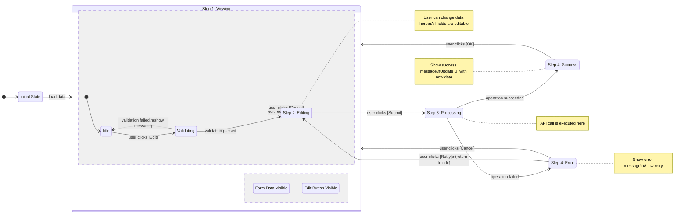

```mermaid
stateDiagram-v2
    direction LR

    state "Initial State" as initial
    state "Step 1: Viewing" as s1
    state "Step 2: Editing" as s2
    state "Step 3: Processing" as s3
    state "Step 4: Success" as success
    state "Step 4: Error" as error

    [*] --> initial
    initial --> s1 : load data

    state s1 {
        [*] --> Idle
        Idle --> Validating : user clicks [Edit]
        Validating --> Idle : validation failed\n(show message)
        Validating --> s2 : validation passed
        --
        state "Form Data Visible" as data_s1
        state "Edit Button Visible" as btn_s1
    }

    s1 --> s2 : edit requested
    note right of s2 : User can change data here\nAll fields are editable
    s2 --> s1 : user clicks [Cancel]

    s2 --> s3 : user clicks [Submit]
    note right of s3 : API call is executed here

    s3 --> success : operation succeeded
    note left of success : Show success message\nUpdate UI with new data

    s3 --> error : operation failed
    note right of error : Show error message\nAllow retry

    success --> s1 : user clicks [OK]
    error --> s2 : user clicks [Retry]\n(return to edit)
    error --> s1 : user clicks [Cancel]

```
